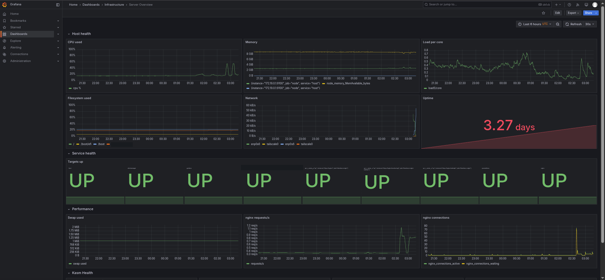
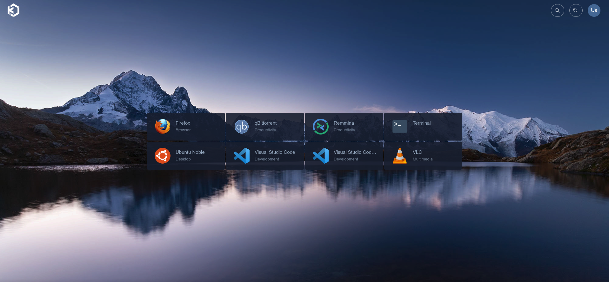
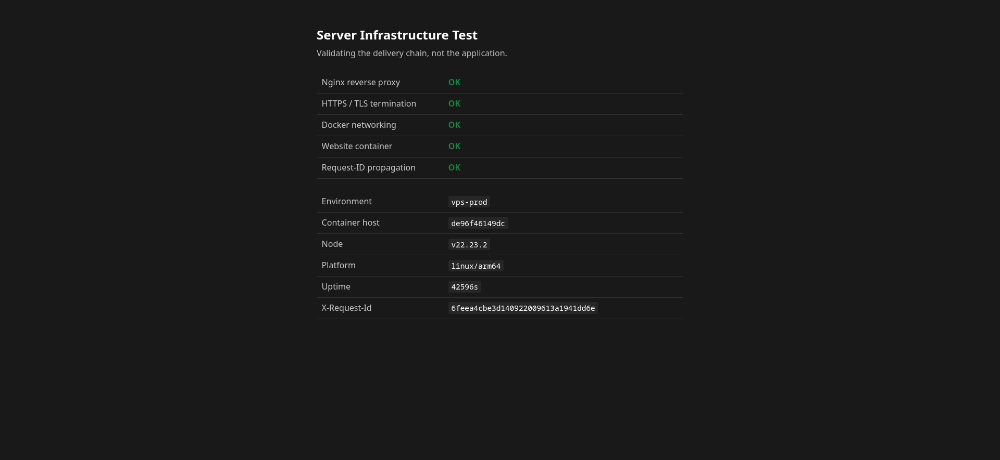

# OneBox

**A complete, monitored, backed-up production platform on a single server — and the operating discipline to run it without breaking it.**

One VPS. Public HTTPS, a full observability stack, a browser-accessible Linux
desktop, encrypted off-site backups with tested restores, and a firewall that
actually filters container traffic. Every service declares its CPU and memory
budget, so nothing starves anything else on 2 cores.

It is not a Kubernetes tutorial or a homelab toy. It is the boring, careful
version: one box, documented decisions, and checks that fail loudly.

---

## Why this exists

Most "deploy your VPS" guides stop at the happy path. This one is the residue
of an actual build, including the parts that went wrong — a firewall that
reported ports blocked while they were open, a backup that uploaded cleanly
with half the data missing, a certificate renewal that would have failed 60
days later for a reason nothing connected to its cause.

Those failures are documented in [`docs/context/DECISIONS.md`](docs/context/DECISIONS.md)
with what was tried and why the fix is what it is. **That file is the most
valuable thing here.** The configs are downstream of it.

---

## What you get

| Path | Service | Notes |
|---|---|---|
| `https://yourdomain.com/` | Your site | Static, or swap in anything |
| `https://yourdomain.com/monitoring/` | Grafana | Dashboards, alert rules |
| `https://yourdomain.com/webrdp/` | Kasm Workspaces | Full Linux desktop in a browser |

Plus, not user-visible:

- **Prometheus + Alertmanager** — 26 alert rules, email on fire and on resolve
- **Blackbox exporter** — probes your endpoints from outside the app, and
  separately *through* Cloudflare, so "my server is down" and "Cloudflare can't
  reach my server" are different alerts
- **Let's Encrypt via DNS-01** — auto-renewing wildcard, **port 80 never opens**
- **Encrypted off-site backups** — zstd-19 + AES-256 to any S3-compatible store,
  with a hard size ceiling and a restore test that actually decrypts
- **Cloudflare-only ingress** — enforced in both the cloud firewall and
  `DOCKER-USER`, with a drift check for when Cloudflare changes its IP ranges
- **fail2ban, auditd, unattended security upgrades, persistent journald**

---

## What it looks like

Screenshots from a live deployment, redacted — the real domain and data-mount
path are blocked out. More in [`docs/screenshots/`](docs/screenshots/).

### The monitoring dashboard at `/monitoring/`



Host health, load per core, network throughput, filesystem usage, nine scrape
targets up, and nginx request rate — all on a 2-vCPU box.

### A Linux desktop in the browser at `/webrdp/`



Firefox, VS Code, a terminal, or a full Ubuntu desktop — no client to install.

### The delivery chain at `/`



The placeholder site, confirming nginx, TLS termination, Docker networking and
request-ID propagation all work end to end.

---

## Architecture

```
                          ┌──────────────┐
        the internet ────▶│  Cloudflare  │  DNS · TLS · DDoS · WAF
                          └──────┬───────┘
                                 │ only Cloudflare's 15 IP ranges
                                 │ are allowed inbound on 443
   ═══════════════════════════════▼═══════════════════════════════════
   ║  YOUR SERVER            2 vCPU · 12 GB RAM · ARM64 or AMD64     ║
   ║                                                                 ║
   ║   ┌──────────────────────────────────────────────────────┐      ║
   ║   │  nginx  :443                                         │      ║
   ║   │  the ONLY container that publishes a port            │      ║
   ║   └───┬──────────────┬──────────────────┬────────────────┘      ║
   ║       │ /            │ /monitoring/     │ /webrdp/              ║
   ║  ┌────▼─────┐   ┌────▼─────┐      ┌─────▼──────────────┐        ║
   ║  │ website  │   │ Grafana  │      │ Kasm Workspaces    │        ║
   ║  └──────────┘   └────┬─────┘      │  proxy · api · db  │        ║
   ║                      │            │  agent · guac      │        ║
   ║                 ┌────▼───────┐    └─────┬──────────────┘        ║
   ║                 │ Prometheus │          │ spawns                ║
   ║                 └────┬───────┘    ┌─────▼──────────────┐        ║
   ║                      │            │ desktop containers │        ║
   ║          ┌───────────┼──────────┐ └────────────────────┘        ║
   ║          ▼           ▼          ▼                               ║
   ║   ┌───────────┐ ┌─────────┐ ┌──────────────┐                    ║
   ║   │Alertmanager│ │blackbox │ │node_exporter │ (systemd, on host)│
   ║   └─────┬─────┘ └─────────┘ └──────────────┘                    ║
   ║         │ email                                                 ║
   ║   ┌─────▼──────┐                                                ║
   ║   │alert-bridge│──────▶ Brevo ──────▶ your inbox                ║
   ║   └────────────┘                                                ║
   ║                                                                 ║
   ║   backups ──▶ local (14 daily) ──▶ S3-compatible, encrypted     ║
   ═════════════════════════════════════════════════════════════════
                                 ▲
                                 │ SSH + RDP, never public
                          ┌──────┴───────┐
                          │  Tailscale   │
                          └──────────────┘
```

### Two networks, and why

```
proxy-net    nginx + anything nginx proxies to directly
backend-net  internal:true — service-to-service only, NO egress
```

nginx is the only member of both. Prometheus, Alertmanager and the databases
never join `proxy-net`, so nothing can reach them from outside even if nginx is
misconfigured. Both are created **external** so projects can be brought up and
down independently without Compose destroying a network another project is on.

### Path-based, not subdomain-based

`/monitoring/`, not `monitoring.yourdomain.com`. One certificate, one DNS
record, one firewall rule. The cost is that Cloudflare's orange/grey proxy
toggle becomes all-or-nothing for the whole platform — a real trade-off,
[recorded as such](docs/context/DECISIONS.md).

---

## Resource budget

Tuned for **2 vCPU / 12 GB**. Measured at idle, not estimated:

| Service | CPU limit | Memory limit | Reserved |
|---|---|---|---|
| Prometheus | 0.50 | 1024 MB | 768 MB |
| Grafana | 0.40 | 512 MB | 256 MB |
| nginx | 0.30 | 192 MB | — |
| Alertmanager | 0.10 | 128 MB | 96 MB |
| blackbox / nginx-exporter | 0.05 | 64 MB | 16 MB |
| Kasm control plane (6 containers) | — | ~2.6 GB total | — |
| Kasm desktop session | 1.0 | 2048 MB | — |

**Reservations are the load-bearing setting**, not the limits. They tell the
kernel what to protect, so a desktop workspace is evicted before Prometheus is.

Two things worth knowing before you size a box:

- **`dockerd` + `containerd` burn ~11% of 2 vCPU at idle** across 16 containers.
  That is the cost of the runtime itself, before any of your services run.
- **RAM and disk are abundant; CPU is the constraint.** Pick additions that idle
  cheaply and burst rarely. Anything with sustained CPU — video transcoding, CI
  runners, ML inference — does not belong on this box.

---

## Requirements

- Ubuntu 22.04 or 24.04, **ARM64 or AMD64**
- 2 vCPU / 8 GB minimum; 12 GB comfortable
- Two disks, or one large one: the root volume fills fast and a full root disk
  takes down sshd and Docker *together*
- A domain, with **Cloudflare as DNS** (needed for DNS-01 certificates)
- Tailscale account (free tier is fine) for admin access
- An S3-compatible bucket for off-site backups
- Brevo account (or any SMTP relay) for alert email

Costs nothing beyond the VPS if you use free tiers throughout.

---

## Setup

**Full step-by-step runbook: [`SETUP.md`](SETUP.md)** — bare server to live
platform, ~60–90 minutes, with a verification check after every step.

```
1  create server            public :22 open temporarily
2  clone repo
3  bootstrap                Docker, Tailscale, XRDP, hardened SSH
4  tailscale up             join the mesh
5  verify tailnet SSH       ← then close public :22
6  .env + render-env.sh     one file, all credentials
7  create networks          proxy-net + internal backend-net
8  nginx + placeholder TLS  breaks the cert/nginx chicken-and-egg
9  DNS at Cloudflare        proxied, SSL mode Full
10 real certificate         DNS-01 → then switch to Full (Strict)
11 monitoring + alerts      send yourself a test email
12 lock to Cloudflare       cloud firewall + DOCKER-USER
13 backups + restore test   not a backup until the test passes
14 Kasm                     optional
15 audit + write STATE.md
```

The order is load-bearing in three places: SSH hardening runs last inside
bootstrap so a broken sshd leaves you a working machine rather than a half-built
one; the certificate needs nginx running, and nginx needs *a* certificate, so
step 8 uses a throwaway; and the Cloudflare lockdown must come after TLS,
because it is what makes DNS-01 mandatory.

## The four traps this codebase exists to remember

**1. UFW does not protect published Docker ports.** Docker writes into the
`DOCKER` chain, evaluated *before* UFW's. A `-p 9090:9090` container is
reachable from the internet with UFW default-deny, and **UFW reports it as
blocked**. Filter in `DOCKER-USER`, or don't publish the port.

**2. An sshd `Match` block applies to everything below it, to EOF.** It must be
last in the file. And `sshd -T` does **not** print `Match` blocks — the config
will look correct while behaving differently. You cannot audit this with
`sshd -T` alone.

**3. Locking ingress to Cloudflare breaks HTTP-01 certificate renewal.** Let's
Encrypt validates from its own IPs, which are not Cloudflare's. Renewal fails
~60 days later with nothing linking it to the firewall change. DNS-01 needs no
inbound path at all.

**4. "Running" is not "serving".** Every healthcheck here hits a real endpoint.
A Kasm proxy reported healthy for hours while its writable layer was gone,
because its check never touched it.

---

## Repository layout

```
bootstrap/        one-shot provisioning for a fresh server
proxy-nginx/      nginx: TLS termination, path routing, JSON access logs
monitoring/       Prometheus · Grafana · Alertmanager · blackbox · exporters
alert-bridge/     Alertmanager webhook -> Brevo API, HTML alert emails
kasm/             Kasm Workspaces notes + a custom image with an SSH client
host/             systemd units, iptables, auditd, fail2ban, sysctl, journald
scripts/          backup, restore-test, certs, firewall, drift, audits
docs/context/     DECISIONS.md · STATE.md · ENVIRONMENT.md  ← read these
.claude/          rules, hooks and skills for AI-assisted operation
```

---

## AI-assisted operation

This platform was built with [Claude Code](https://claude.com/claude-code) as a
pair, and `.claude/` carries that setup — it is optional and the platform runs
fine without it.

- **`rules/`** — production safety, logging standard, Docker/infra contract,
  secrets and git discipline. Loaded automatically.
- **`hooks/`** — capture every prompt and tool call to an audit log, block
  destructive commands, rehydrate project state at session start.
- **`skills/`** — session continuity, pre/post-flight infra gates.

The idea worth stealing regardless of tooling: **`docs/context/` is canonical
and portable.** Decisions live in the repo, not in a chat history or one
machine's memory. Switching machines, accounts, or assistants loses nothing.

One hard lesson is baked into the hooks: pattern-based secret redaction is not
enough. A secret pasted bare into a command line has no `key=value` shape and
often no prefix — an S3 access key is 40 hex characters, indistinguishable from
a git SHA. There is now a denylist of literal values as well.

---

## Security posture

- Only **443** is public, and only from Cloudflare's ranges
- Admin access via **Tailscale only** — SSH and RDP are never exposed
- SSH: root disabled, password auth off globally, allowed only for one user
  from the tailnet
- Every container: `no-new-privileges`, dropped capabilities, read-only rootfs
  where possible, explicit resource limits
- Secrets in `.env` files at mode `600`, never in git, never on a command line
- Backups encrypted **before** they leave the host
- auditd watches identity and config files; journald is persistent and bounded

**Not claimed:** this is a single-node platform with no HA, and it has not been
through a third-party audit.

---

## Adapting it

Nothing here is Oracle-specific except a few notes. It runs on Hetzner, DigitalOcean,
Vultr, or a machine under your desk. `DOMAIN`, `DATA_ROOT` and the resource
limits are the only values you must change.

Swap Cloudflare for another DNS provider by changing the certbot plugin in
`scripts/cert-issue.sh` — DNS-01 is supported by most.

---

## License

MIT. Use it, fork it, deploy it. No warranty: it is infrastructure, and you are
responsible for what you run.
